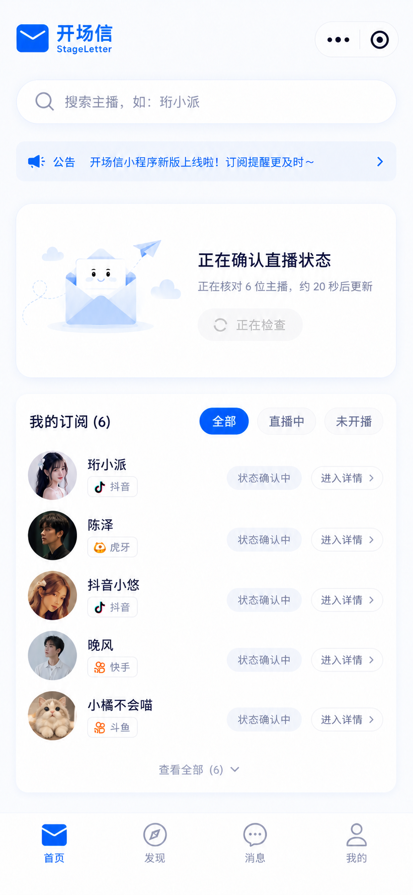
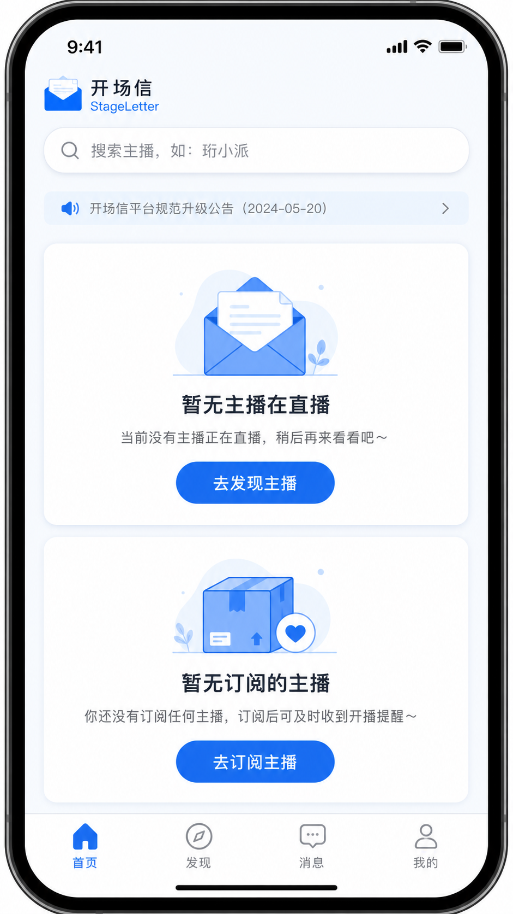
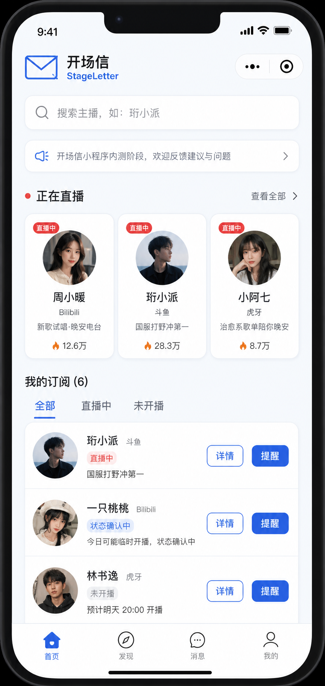

# F-ALPHA-01 — 直播状态可信刷新与首页状态体验

状态：**Slice A 已实现并完成定向回归；Slice B 视觉实现待原型确认；Slice C 待真实平台验收**
版本：v0.1 · 2026-08-24
关联：V1 Alpha P0、`/api/v1/lives/refresh`、Gate 2 检测引擎、Gate 4 首页

## 1. 业务目标与边界

### 用户问题

用户订阅主播后，首页曾长时间显示“未知/确认中”，即使平台实际正在开播也没有变化。直播通知产品不能把“探测任务已经发起”误当成“用户已经得到直播结论”。

### 用户故事

> 作为订阅了主播的用户，我希望首页清楚告诉我状态正在刷新、正在确认、已开播或未开播，并能在需要时手动刷新，从而判断是否应该进入直播间。

### 成功指标

- 对已订阅且平台可用的主播，刷新后能在两次独立探测确认窗口内显示 `LIVE` 或 `OFFLINE`。
- 探测/网络失败不显示为“未开播”；用户能看到可理解的“暂时无法确认”和重试入口。
- 刷新动作不绕过 Gate 2 的平台容量、lease、限流和隔离边界。

### 非目标

- 不把首页做成全量平台监控台。
- 不承诺瞬时、端到端 exactly-once 或平台绝对实时数据。
- 不在本功能中改变通知额度、微信 grant 或订阅排序策略。

## 2. 低保真原型与布局

### 高保真视觉原型：H-01（订阅有数据，直播确认中）



该图是 H-01 的唯一评审稿，用于评审信息层级、按钮位置、间距、状态文案和底部安全区；每个订阅行保留明确的“进入详情”入口，整行点击也进入同一详情页。主播头像、名称与平台标签均为视觉占位，正式页面必须绑定真实 API 数据。品牌头和公告条以 `UI-DESIGN.md` 的冻结规范及正式组件资产为准；图中的右上角胶囊仅为微信容器示意，不是应用内控件。

### 高保真视觉原型：H-00（两块区域均为空）



新用户没有任何订阅时，页面保留两张独立空态卡：第一张引导发现，第二张解释订阅价值并引导订阅。两张卡的间距与第二张卡到 TabBar 的安全距离保持一致。

### 高保真视觉原型：H-11（正在直播与订阅均有数据）



日常状态下，“正在直播”显示已确认 `LIVE` 的横向卡片，“我的订阅”仍显示全部订阅及混合状态。主播、头像、直播标题、热度与平台文字均为原型占位，正式实现必须来自 API，不可写死。

### 首页（有订阅、暂无确认直播）

```text
┌────────────────────────────────────┐
│ [品牌信封] 开场信                  │
│ [搜索主播，如：珩小派             ] │
│ [公告滚动条                        ] │
│                                    │
│ 正在直播 · ●             [刷新 ⟳] │  ← 区域标题行
│ ┌────────────────────────────────┐ │
│ │        状态正在确认             │ │
│ │ 已为你检查 6 位主播，约 10 秒后更新 │ │
│ │                  [稍后自动更新] │ │
│ └────────────────────────────────┘ │
│                                    │
│ 我的订阅 (6)                        │
│ [全部] [直播中] [未开播]            │
│ ┌ 头像 大龙猫  状态确认中  [详情][提醒]┐│
│ └────────────────────────────────┘ │
│ 固定底部： 首页 / 发现 / 消息 / 我的 │
└────────────────────────────────────┘
```

### 布局约束

- 页面左右内容边距 `24rpx`；区域间距使用 `16rpx / 24rpx / 32rpx` 节奏。
- “正在直播”标题行位于公告下方 `24rpx`；右侧 `刷新` 为文字加统一线性刷新图标，点击热区最小 `88rpx × 88rpx`，不得与“查看全部”并存造成两个含义不清的右侧操作。
- `LIVE` 时保留横向直播卡；没有 `LIVE` 且有确认中的订阅时显示“状态正在确认”卡；全部离线时显示现有“暂无主播在直播”卡。
- 底部 TabBar 固定；内容滚动区必须留出 TabBar 和安全区间距，最后一张卡片不得被菜单遮挡。
- 不设置“未知”筛选 Tab。`UNKNOWN/DEGRADED` 条目仍出现在“全部”中，行内展示“暂时无法确认”。

### 状态视觉与文案

| 真实状态 | UI 标签 | 首页区域 | 行内说明 | 可执行动作 |
| --- | --- | --- | --- | --- |
| `LIVE` | 直播中（红色点/标签） | 横向正在直播卡 | 已确认直播 | 查看详情、管理提醒、前往观看（后续功能） |
| `CHECKING` / `CONFIRMING` | 状态确认中（蓝灰） | 确认卡 | 仅在检测到状态翻转后进行二次探测，或已在线状态超过新鲜度窗口 | 等待自动更新；冷却结束后可刷新 |
| `OFFLINE` | 未开播（中性灰） | 不进入直播横卡 | 等待下一次开播 | 查看详情、管理提醒 |
| `UNKNOWN` / `DEGRADED` | 暂时无法确认（橙色） | 不计入直播数 | 平台响应暂不可用 | 刷新；进入详情查看最后检测时间 |

### 确认中时限

“状态确认中”是为了避免一次瞬时响应造成误报的过渡态，不是长期状态：

1. 第一次有效 probe 与现有确认状态相反时，进入 `CHECKING/CONFIRMING`。
2. 系统请求第二次**独立**探测；手动刷新会在首次观察后的 `8 秒`主动补做一次，正常目标为 `8–20 秒`内完成，仍须服从平台 lease、容量和限流。
3. 两次结果一致才落为 `LIVE` 或 `OFFLINE`。
4. 已订阅主播的在线/离线探测节奏分别为 `15 秒 / 30 秒`；已确认的离线结果在 `75 秒`失效前仍显示“未开播”，不会因为正常轮询间隙闪烁为确认中。只有状态翻转后的二次确认或过期的已在线状态显示确认中；`75 秒`仍无可信结果时自动转为 `UNKNOWN/DEGRADED`，绝不永久显示确认中，也绝不猜测为未开播。
5. 手动刷新受 `30 秒`冷却保护；冷却中展示“正在检查”，不能反复触发 provider 请求。

### 首页状态组合

首页的“正在直播”只展示**当前用户已订阅**且已确认 `LIVE` 的主播，因此存在三种有效组合：

| 编号 | 正在直播区域 | 我的订阅区域 | 页面目的 |
| --- | --- | --- | --- |
| H-00 | 空态 | 空态 | 新用户：引导去发现主播并订阅 |
| H-01 | 空态/确认态 | 有数据 | 已订阅但暂无确认开播：展示确认或空态卡，同时保留订阅清单 |
| H-11 | 有数据 | 有数据 | 日常主要场景：横向直播卡 + 完整订阅清单 |

`正在直播有数据、我的订阅为空` 在该产品的业务定义下不可能成立：直播卡的数据来源就是“我的订阅”。若出现，属于前后端数据一致性错误，应记录并回退为 H-00/H-01，不做第四种视觉页面。

设计系统依据：浅蓝背景 `#F8FAFC`、品牌主色 `#2563EB`、深色文字 `#1E293B`、白色卡片与轻阴影；微信小程序使用系统字体，不能依赖网页字体下载。图标使用统一线性 SVG/小程序图标资源，禁止使用 emoji 代替操作图标。

## 3. 交互与逻辑矩阵

| 控件与位置 | 用户动作 | 前端行为 | API / 参数 | 后端逻辑与数据 | 成功反馈 | 失败/边界反馈 |
| --- | --- | --- | --- | --- | --- |
| 首页首次进入 | `onShow` | 先显示缓存列表；30 秒内不重复触发 | `GET /lives/active`、`GET /subscriptions` | 仅读取当前用户状态 | 渲染最新快照 | 保留旧列表，顶部轻提示“数据加载失败” |
| “正在直播”标题行右侧刷新 | 点击 | 图标旋转、按钮禁用，显示“正在检查” | `POST /lives/refresh?openid=` | 为当前用户订阅账号提交优先探测；必须遵守 worker lease/容量限制 | “已开始检查”，8–12 秒后自动重新拉取 | 显示“暂时无法刷新，请稍后重试”；不清空原状态 |
| 自动回读 | 刷新请求被接受后 | 8–12 秒后重新拉取；确认中时仅追加一次延迟回读 | `GET /lives/active`、`GET /subscriptions` | 返回已持久化状态，不用前端推测 | `LIVE/OFFLINE` 替换确认态 | 仍为确认中时显示下一次预计检查，而非假定离线 |
| 订阅列表“全部” | 点击 | 显示所有订阅，按 `LIVE → CONFIRMING → UNKNOWN/DEGRADED → OFFLINE` | 无新请求 | 无 | Tab 高亮 | 无 |
| 订阅列表“直播中/未开播” | 点击 | 仅过滤已有快照 | 无新请求 | 无 | 即时切换 | 空列表显示解释性空态 |
| 订阅行“进入详情” | 点击 | 跳转 `pages/detail/index?id=` | `GET /anchors/{id}` | 读取主播及最后探测信息 | 展示详情 | ID 不存在/网络失败显示可返回错误页 |

## 4. 数据与接口契约

### 状态来源

- `PlatformAccount.last_status` 与状态机事件是唯一业务真相；前端不可根据请求是否成功自行把主播标为 `OFFLINE`。
- `LIVE` 仅来自已确认的 live session / 状态机；`CHECKING/CONFIRMING` 是二次确认期间的过渡态。
- `UNKNOWN/DEGRADED` 表示供应商、解析或健康状态不足，须保留最后成功检测时间。

### 刷新接口目标契约

`POST /api/v1/lives/refresh?openid=<openid>` 应返回“已受理”而非伪装为刷新后的即时结果：

```json
{
  "status": "accepted",
  "target_count": 6,
  "poll_after_ms": 10000,
  "cooldown_until": "2026-08-24T10:00:30Z"
}
```

- 后台任务逐账号获得 Gate 2 detection lease，按平台并发/容量限制执行；不可在 HTTP 请求事务中做 provider I/O。
- 每个账号独立提交或回滚；单个平台失败不得阻塞其余订阅账号。
- 写 `live_events` 时必须同时写 `occurred_at` 与 `detected_at`，避免 schema 漂移导致整轮回滚。
- 前端随后读取既有查询接口；不暴露 API Key、provider 原始错误或用户 openid。

## 5. 实现切片与验收

### Slice A：状态持久化与隔离（P0）

- 已完成：修复/验证 `LiveEvent.occurred_at`、账号级 rollback、刷新任务 lease 与日志；`POST /lives/refresh` 现返回“已受理”而非旧快照，并对同一用户实施 30 秒进程内冷却。
- 已验证：Gate 2.5 lease、持久化模型及搜索排序定向回归 `25 passed`；Python/小程序脚本语法检查通过。
- 待真实验收：一个账号失败时其余账号仍更新；数据库不出现 transaction rollback；重启后状态仍可读取。该项必须连接实际 PostgreSQL 与平台账号完成，不能以单元测试替代。

### Slice B：首页确认态与手动刷新（P0）

- 实现刷新冷却、确认卡、自动回读、行内“暂时无法确认”文案和安全区布局。
- 验收：小程序点击有加载反馈；按钮无效时明确禁用；小屏幕无需因 TabBar 重叠而滚动。

### Slice C：真实平台验收（P0）

- 使用至少一名真实开播与一名真实未开播的已订阅主播，验证两次独立探测后状态。
- 验收证据：后端日志、数据库持久化、开发者工具截图；真实微信通知需另行授权。

## 6. 风险与待确认项

- 抖音昵称搜索得到的 `live_status` 是搜索时快照，不能替代已订阅账号的正式状态机探测。
- 平台限流或 TikHub 额度不足时，UI 应展示“暂时无法确认”，不可重试风暴。
- 本功能的高保真稿应在 Slice B 前基于当前 375px 真机截图制作；评审确认后才改 WXML/WXSS。
